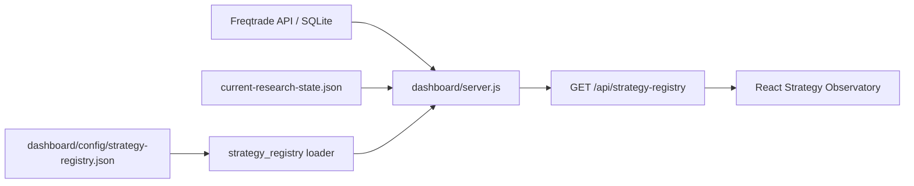

# Frontend Product & Visualization Agent Charter

## 目标

前端是独立的重要模块，不再是策略版本发布后的手工补丁。`Frontend Product & Visualization Agent` 负责把运行、研究与证据状态转化为清晰、可信、可验证的界面，同时兼顾金融初学者和专业用户。

## 权限边界

Agent 可以：

- 维护 `dashboard/web/`、设计系统、交互、可访问性、性能预算和前端测试。
- 读取并展示 `Strategy Registry v1`、运行时观测和研究快照。
- 在不改变业务含义的前提下，改进信息架构、文案与可视化。
- 复用许可证兼容的开源组件；记录依赖、许可证和包体影响。

Agent 不可以：

- 修改策略逻辑、回测结论、研究证据或策略晋级状态。
- 把文件名、数组位置或版本号当成策略身份。
- 用推测值、随机图形或静态样例伪装真实金融数据。
- 在没有来源、时间戳和错误状态的情况下声称数据为实时。

策略研究仍由研究治理流程决定；前端只消费其只读结果。

## 权威数据链

- `strategy_id` 是稳定身份；显示名和版本号只是属性。
- 注册表描述部署运行事实；`current-research-state.json` 描述研究事实。两者必须并列展示，禁止混为一谈。
- 注册表通过 schema 验证且要求恰好一个 `current`；配置变化无需修改前端代码。
- 运行状态失败时返回明确的 `ok=false` 和原因，界面进入降级态而不是展示旧结论。

## 设计系统

- 颜色：近黑中性背景；青色代表健康，琥珀色代表注意，红色代表风险，蓝色代表交互。
- 字体：Sora 用于正文与标题；JetBrains Mono 只用于指标、时间和标识符。
- 结构：4px 网格，主要间距为 8/12/16/24/32px；圆角 6–10px；两级阴影。
- 动效：160–240ms，并尊重 `prefers-reduced-motion`。
- 默认界面采用“决策驾驶舱”；Tweaks 面板可切换“专家终端”和“引导叙事”方案。
- 初学者先看到“这是什么、收益如何、市场怎么走、数据有多新”；专业用户可以展开策略类名、来源、延迟、哈希和分项绩效。

## 开源复用策略

- 使用 React、Vite、TypeScript 和 TanStack Query 处理组件、构建与实时刷新。
- 继续复用现有 Lightweight Charts，只有 `/api/market` 返回的真实 OHLCV 进入 K 线；组件在市场数据可用后异步加载。
- `freqtrade/frequi` 作为交互和领域模型参考，因 GPL-3.0 不直接复制源码进本仓库。
- 新组件库必须按需引入，不能以整库依赖替代少量稳定组件。

## 性能预算

- 首屏自有 JavaScript gzip 目标不超过 180 KiB，CSS gzip 目标不超过 40 KiB。
- 首屏并行请求策略聚合端点和市场端点；策略状态默认 5 秒刷新，K 线默认 15 秒刷新，避免串行瀑布。
- 图表组件在真实 OHLCV 到达后按需加载；避免为了少量策略卡片引入虚拟化开销。
- 桌面和移动端均不得产生页面级横向滚动；44px 是主要交互控件的最小触达高度。

## 完成定义

每次前端变更至少满足：

1. 注册表 schema、Node 契约测试、前端单测、Lint、TypeScript 和生产构建通过。
2. 真实浏览器验证桌面与移动布局、三种方案、loading/error/empty 降级状态和控制台错误。
3. 记录生成资源大小；超预算必须解释或拆分。
4. 策略切换演练只修改注册表，确认 API 和界面同步变化，不改 UI 源码。
5. 高风险策略文件、研究状态和交易逻辑没有因前端任务被修改。

## 收益、K 线与多策略对比

- 当前运行策略显示模拟盘总收益、已实现收益、当前浮盈亏、收益率和交易样本；运行源不可用时保持 `null`，禁止显示为 0。
- 市场模块显示当前交易对、真实当前价、5m/15m/1h/4h K 线和数据新鲜度；价格走势不等于交易建议。
- 多策略对比按总收益、浮盈亏、最大回撤、胜率、利润因子和平仓样本分别判断。至少两个策略拥有完整绩效数据前，不生成“谁更优”的排名。

## 当前迁移边界

本阶段已迁移运行策略身份、对比关系和主界面数据链。旧版 `/api/report-v11*` 报告端点仍含版本命名，保留为兼容层；后续应迁移为按 `strategy_id` 查询的通用证据端点，再删除旧命名。
