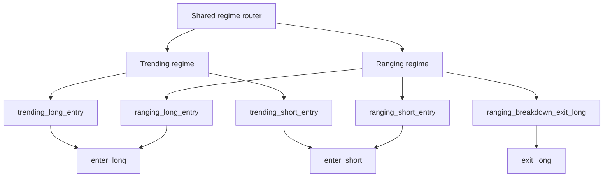

# Current Regime-conditioned Structure Map

Campaign fingerprint: `5f759a309a23e684bbd3277a3aff1de3b075c01ddd22e2d3f67e57e00c7c8fe3`

## Condition ownership

- `shared_router` (3): `regime_trending`, `regime_ranging`, `volume_gt_0`
- `long_branch` (14): `trend_4h_up`, `close_gt_ema200`, `pullback_ema_long`, `bb_breakout_long`, `rsi_recovery`, `trending_long_trigger_any`, `ranging_long_setup`, `rlong_bb_percent_lt_0_20`, `rlong_rsi_lt_40`, `rlong_volume_gt_mean_0_8`, `rlong_close_gt_ema200_0_92`, `rlong_bb_width_4h_lt_mean_1_3`, `rlong_adx_4h_lt_22`, `exit_long_close_lt_ema200_0_90`
- `short_branch` (12): `trend_4h_down`, `close_lt_ema200`, `pullback_ema_short`, `bb_breakout_short`, `rsi_exhaustion`, `trending_short_trigger_any`, `ranging_short_setup`, `rshort_bb_percent_gt_0_80`, `rshort_rsi_gt_60`, `rshort_volume_gt_mean_0_8`, `rshort_bb_width_4h_lt_mean_1_3`, `rshort_adx_4h_lt_22`

All 29 conditions have exactly one structural owner. Shared conditions may be consumed by multiple regime/signal groups without being duplicated.

## Regime and signal groups

- `trending` -> `trending_long_entry` / `long` / `enter_long` (5 conditions)
- `trending` -> `trending_short_entry` / `short` / `enter_short` (5 conditions)
- `ranging` -> `ranging_long_entry` / `long` / `enter_long` (9 conditions)
- `ranging` -> `ranging_short_entry` / `short` / `enter_short` (8 conditions)
- `ranging` -> `ranging_breakdown_exit_long` / `long` / `exit_long` (3 conditions)

## Frozen research order

1. Current work: read-only mapping and dry-run compilation only.
2. Future approval: exactly one Candidate extracting only the router interface/location.
3. Exact semantic-equivalence gate: 8 Backtest invocations across baseline/Candidate, BTC/ETH and RUN-A/RUN-B.
4. Any branch contribution ablation is a separate, later Campaign after equivalence and new human approval.
